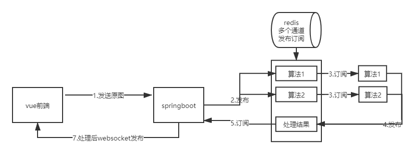

##### 本地springboot连接远程服务器redis

- redis安装

  - 官网下载 ： https://redis.io/
  - 解压 `tar -zxvf redis-6.0.7.tar.gz`
  - 进入解压后的文件夹，make编译；如果想全局使用再make install
  - 进入src文件夹，将`redis-server`和`redis-cli`复制到上一级目录

- 修改配置文件用于外网访问

  - 修改`redis.conf`

  - `bind 127.0.0.1` ->  `bind 0.0.0.0`

    `protected-mode yes` ->  `protected-mode no`
    
  - `port` 可任意修改，这里修改为`6389`
  
- 将redis端口放入防火墙计划中

  - `sudo /sbin/iptables -I INPUT -p tcp --dport 6379 -j ACCEPT `

##### 系统架构图

